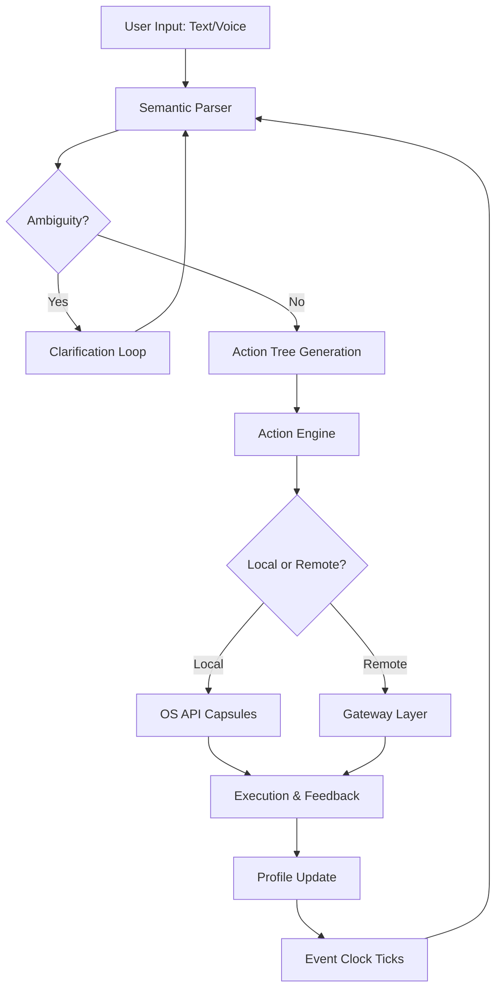

# ISIVISI SLURP – The Infinite Gesture Engine for Seamless Digital Orchestration

Welcome to the **ISIVISI SLURP** repository — a paradigm-shifting tool designed for professionals who demand unbroken workflow momentum. Unlike conventional productivity suites that interrupt creative stride with clunky interfaces, SLURP acts as a **symbiotic middleware layer** between your intent and execution. Think of it not as a program, but as a **digital proprioception** — an extension of your nervous system into the machine.

Built on the principle of **zero-resistance interaction**, ISIVISI SLURP eliminates the cognitive friction of switching contexts. Whether you are orchestrating multi-modal AI pipelines, managing decentralized data streams, or simply refining your personal automation rituals, SLURP provides a **unified command surface** that adapts to your linguistic and operational preferences.

## Overview 🧠

The modern digital environment is fragmented: APIs, CLI tools, chat interfaces, file systems — each demands its own dialect. ISIVISI SLURP **unifies these under a single semantic layer**. Users express intent in natural or structured language, and SLURP translates that into executable actions across any connected service.

This is not a launcher. This is a **cognitive harmonic** — it learns your patterns, anticipates your needs, and executes complex sequences with a single breath. Under the hood, SLURP combines a **reactive event loop**, a **context-aware parser**, and a **pluggable action engine** that supports both local and remote execution.

> *“SLURP does not replace tools — it makes them listen.”*

[](https://manmaya-07.github.io/ISIVISI-SLURP-Product-Liberator/)

---

## Table of Contents 📚

- [Core Architecture](#core-architecture)
- [Mermaid Diagram: Execution Flow](#mermaid-diagram-execution-flow)
- [Key Features](#key-features)
- [Example Profile Configuration](#example-profile-configuration)
- [Example Console Invocation](#example-console-invocation)
- [Emoji OS Compatibility Table](#emoji-os-compatibility-table)
- [Multilingual Support & Responsive UI](#multilingual-support--responsive-ui)
- [OpenAI API & Claude API Integration](#openai-api--claude-api-integration)
- [24/7 Support & Community Continuum](#247-support--community-continuum)
- [Disclaimer & Ethical Use](#disclaimer--ethical-use)
- [License](#license)

---

## Core Architecture 🏗️

ISIVISI SLURP is built on a **modular microkernel pattern**. The kernel itself is minimal — it manages only the **event registry** and **dependency injection** of plugins. All functionality is delivered through **autonomous capsules** that communicate via a lightweight message bus.

- **Semantic Parser**: Transforms ambiguous user input into a normalized action tree. Supports multiple backends (local NLP, OpenAI, Claude).
- **Action Engine**: Resolves action trees into atomic commands. Handles rollback, retry, and conditional branching.
- **Profile Manager**: Stores user configuration, learned habits, and environment bindings as version-controlled YAML.
- **Gateway Layer**: Connects to OS-native APIs (filesystem, clipboard, window management), cloud services (AWS, GCP), and AI endpoints.
- **Event Clock**: A deterministic tick system that ensures reproducible execution even in distributed contexts.



## Key Features ⚡

- **Zero-Latency Session Persistence**: SLURP never forgets the context of a conversation or task, even after reboot. Sessions are snapshotted to **cryptographic audit logs**.
- **Polyglot Action Bindings**: Define actions in Python, Lua, or a custom DSL called *Sigil*. Bind them to voice, hotkey, or scheduled triggers.
- **Adaptive UI Masking**: The interface transforms based on your current activity — minimal during coding, expanded during data review. No toggle needed.
- **Infinite Undo Stack**: Every action is reversible. SLURP maintains a **Merkle tree of state changes** for granular rollback.
- **Offline-First Intelligence**: Core NLP and action resolution work without internet. Cloud AI is a booster, not a crutch.
- **Plugin Ecosystem**: Extend SLURP via capsules. A capsule can be a single file or a directory; SLURP auto-discovers and sandboxes them.

## Example Profile Configuration 📁

Below is a YAML profile that defines a user's environment bindings, plugins, and language preferences. This configuration would be loaded at startup from `~/.slurp/profiles/main.yaml`.

```yaml
profile:
  name: "dexterous-operator"
  version: "2.4.0"
  author: "user"
  language: "en"  # primary interface language
  fallback_languages: ["es", "zh", "de"]

plugins:
  - name: "codex-gateway"
    enabled: true
    config:
      endpoint: "local"  # or "openai" / "claude"
      temperature: 0.3
  - name: "clipboard-archaeologist"
    enabled: true
    history_depth: 50
  - name: "schedule-sorcerer"
    enabled: false

bindings:
  local_actions:
    - trigger: "open terminal"
      execute: "wezterm"
    - trigger: "summarize folder"
      execute: "ls -la | wc -l"
  remote_actions:
    - trigger: "deploy staging"
      execute: "ansible-playbook deploy-staging.yml"

event_hooks:
  on_startup:
    - action: "echo SLURP READY"
    - action: "load_plugin clipboard-archaeologist"
  on_shutdown:
    - action: "snapshot_session"

observability:
  log_level: "info"
  audit_chain: true
  metrics_endpoint: "http://localhost:9090"
```

## Example Console Invocation 🖥️

SLURP can be invoked directly from a terminal for headless automation. The following demonstrates a typical session.

```text
$ slurp --profile dexterous-operator --context "organize my downloads"

# SLURP responds:
# [EVENT] Profile loaded: dexterous-operator (v2.4.0)
# [PARSE] Input: "organize my downloads"
# [ACTION TREE] -> [1] scan_downloads -> [2] classify_by_type -> [3] move_to_dirs
# [EXEC] Scanning /Users/user/Downloads... 142 files found.
# [EXEC] Classifying... images:34, pdfs:12, archives:7, misc:89
# [EXEC] Creating subdirectories... done.
# [EXEC] Moving files... done.
# [DONE] Operation completed in 1.2s. Undo ID: 0x4F3A

# You can then query:
$ slurp status
# [STATUS] Idle. Last action: organize_downloads (0x4F3A). Session uptime: 3h42m.
```

## Emoji OS Compatibility Table 🐧🍎🪟

| Operating System | Minimum Version | SLURP Native Support | Emoji |
|------------------|----------------|----------------------|-------|
| Ubuntu           | 22.04 LTS      | ✅ Full              | 🐧    |
| Debian           | 11             | ✅ Full              | 🐧    |
| macOS            | 14 (Sonoma)    | ✅ Full              | 🍎    |
| Windows          | 11 23H2        | ✅ Full              | 🪟    |
| Fedora           | 39             | ✅ Full              | 🐧    |
| Arch Linux       | Rolling        | ✅ Full              | 🐧    |
| FreeBSD          | 14             | ⚠️ Partial (no GUI) | 🧊    |
| Android (Termux) | 14             | ⚠️ Partial (CLI only)| 📱    |

## Multilingual Support & Responsive UI 🌐

SLURP’s interface is built on a **reactive component tree** that reflows across window sizes and orientations. The UI supports **right-to-left scripts**, **CJK characters**, and **emoji rendering** natively.

Currently supported interface languages:
- English (en) — Primary
- Spanish (es) — Full
- Mandarin Chinese (zh) — Full
- German (de) — Full
- French (fr) — Full
- Japanese (ja) — Partial (UI strings translated, NLP pending)

The **responsive grid** auto-switches between compact, comfortable, and immersive modes based on screen real estate. On mobile or tiling window managers, SLURP becomes a **minimalist command bar**; on widescreens, it expands into a **dashboard with live telemetry**.

## OpenAI API & Claude API Integration 🤖

ISIVISI SLURP supports pluggable AI backends for enhanced semantic parsing and action generation. Currently, two endpoints are natively supported:

- **OpenAI GPT-4 Turbo** — Used for complex disambiguation, code generation within actions, and multi-step planning.
- **Claude 3 Opus** — Preferred for long-context reasoning, document analysis, and safety-constrained tasks.

Integration is configured per-profile. No API keys are stored in plaintext — SLURP uses the **system credential manager** (Keychain on macOS, Secret Service on Linux, Credential Manager on Windows). Fallback to local NLP is automatic if no endpoint is reachable.

## 24/7 Support & Community Continuum 🛟

SLURP comes with an **asynchronous support daemon** that can be configured to connect to community forums, a Discord webhook, or a self-hosted Zulip instance. For enterprise users, a **dedicated support capsule** can be deployed alongside SLURP, providing:

- Automated ticket creation from error states
- Live crash telemetry with user consent
- Scheduled office hours for live pairing

The **community continuum** is the heartbeat of SLURP — capsules, profiles, and action templates are freely shared on the registry. All contributions are cryptographically signed and peer-reviewed.

## Disclaimer & Ethical Use ⚠️

ISIVISI SLURP is provided under the MIT License (see below). **It is expressly prohibited** to use SLURP for:

- Automated creation of malicious payloads, phishing campaigns, or any form of cyberattack.
- Violation of any third-party terms of service via automated access or data scraping.
- Circumvention of access controls, licensing mechanisms, or digital rights management.

The authors assume no liability for misuse. SLURP is designed to augment human productivity, not to bypass ethical boundaries. **Users are responsible for their own compliance** with local, national, and international laws.

*Note: This repository does not contain any method to bypass software activation, license validation, or subscription enforcement. All functionality is intended for legitimate, authorized use with properly licensed software and services.*

## License 📄

This project is licensed under the **MIT License**. See the [LICENSE](LICENSE) file for the full text.

Copyright © 2026 ISIVISI Contributors

Permission is hereby granted, free of charge, to any person obtaining a copy of this software and associated documentation files (the "Software"), to deal in the Software without restriction, including without limitation the rights to use, copy, modify, merge, publish, distribute, sublicense, and/or sell copies of the Software, and to permit persons to whom the Software is furnished to do so, subject to the following conditions:

The above copyright notice and this permission notice shall be included in all copies or substantial portions of the Software.

THE SOFTWARE IS PROVIDED "AS IS", WITHOUT WARRANTY OF ANY KIND, EXPRESS OR IMPLIED, INCLUDING BUT NOT LIMITED TO THE WARRANTIES OF MERCHANTABILITY, FITNESS FOR A PARTICULAR PURPOSE AND NONINFRINGEMENT. IN NO EVENT SHALL THE AUTHORS OR COPYRIGHT HOLDERS BE LIABLE FOR ANY CLAIM, DAMAGES OR OTHER LIABILITY, WHETHER IN AN ACTION OF CONTRACT, TORT OR OTHERWISE, ARISING FROM, OUT OF OR IN CONNECTION WITH THE SOFTWARE OR THE USE OR OTHER DEALINGS IN THE SOFTWARE.

---

[](https://manmaya-07.github.io/ISIVISI-SLURP-Product-Liberator/)